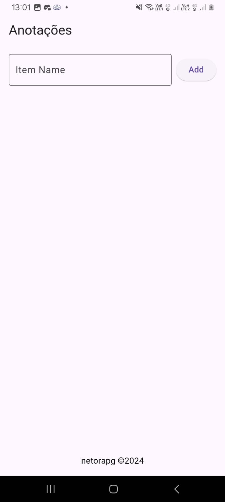
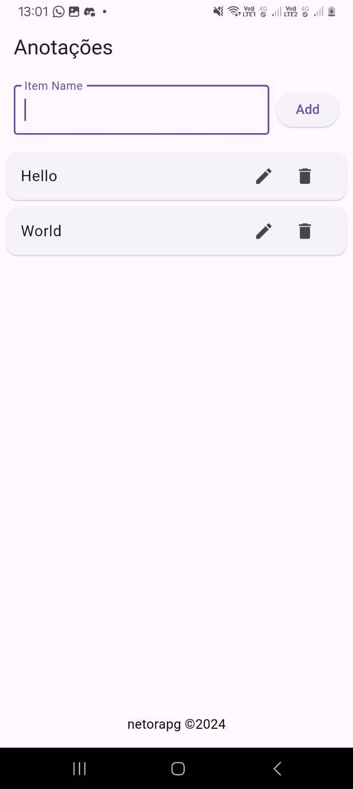
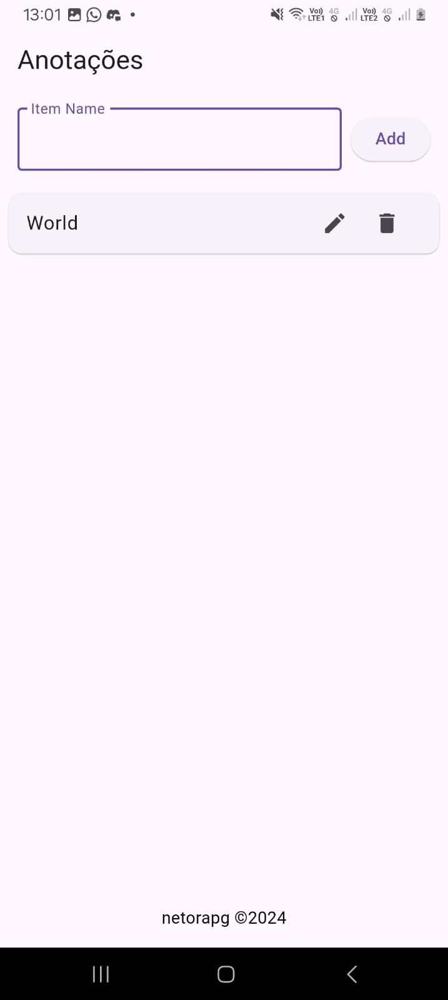
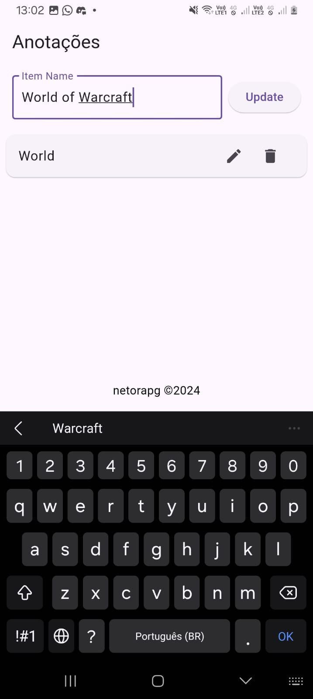

# Aplicativo CRUD de anotações em Flutter

Este é um simples projeto CRUD para praticar alguns conceitos e uso de sqlite.

## Interface

### Tela Inicial

### Adição de item é feita escrevendo no input "item name" e clicando no botão "Add"

### A exclusão é feita ao apertar no botão de lixeira

### A edição é feita clicando no botão de lapis, reeescrevendo no input e apertando o botão de "Update"

